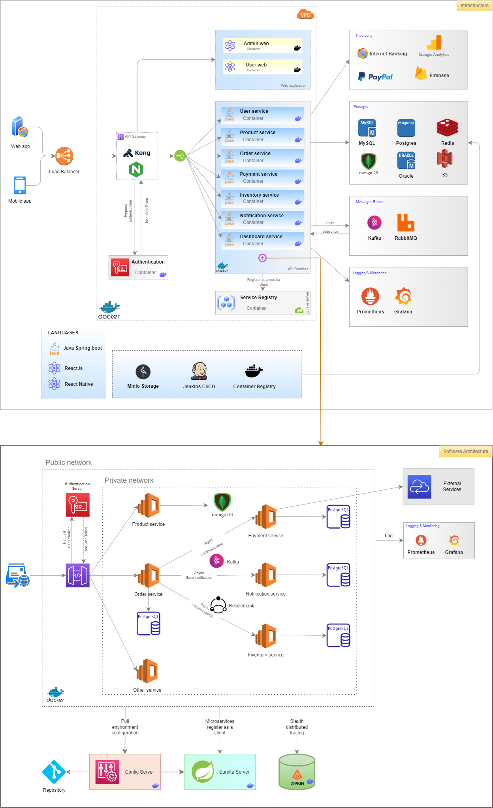

# MICROSERVICES APPLICATION


## I. Local Environment
### 1. Pre-Requisites
- Install JDK 11 or higher
- Install Maven 3.8.6 or higher
- Install Docker
- IntelliJ

### 2. Technical stack
- Java 11
- Spring boot 2.7.5
- Spring cloud 2021.0.2
- Zipkin
- Swagger 3.0
- Docker & Docker compose
- Grafana & Prometheus
- Kafka
- Mongodb
- MySQL
- Postgres
- Redis
- Json Web Token
- ...

### 3. How to build and run microservices
3.1 Build project
- Build all services
```
$ mvn clean verify
```
- Build specify service
```
$ mvn -pl api-gateway product-service -am clean install
```

3.2 Build docker images
- Build all images
```
$ docker-compose up -d --build
```
- Build specify images
```
$ docker-compose up -d --build api-gateway product-service
```
**Note:** May be build & run specify service by IDE


3.3 View API documents
- [Authentication Service API](http://localhost:2630/api/authentication-service/swagger-ui/index.html)
- [Product Service API](http://localhost:2630/api/product-service/swagger-ui/index.html)
- [Inventory Service API](http://localhost:2630/api/inventory-service/swagger-ui/index.html)
- [Order Service API](http://localhost:2630/api/order-service/swagger-ui/index.html)

3.4 Check Application Health
- [API-Gateway Health](http://localhost:2630/actuator/prometheus)
- [Authentication Service Health](http://localhost:2630/api/authentication-service/actuator/prometheus)
- [Product Service Health](http://localhost:2630/api/product-service/actuator/prometheus)
- [Inventory Service Health](http://localhost:2630/api/inventory-service/actuator/prometheus)
- [Order Service Health](http://localhost:2630/api/order-service/actuator/prometheus)
- [Notification Service Health](http://localhost:2630/api/notification-service/actuator/prometheus)

3.5 To update code and rerun
```
$ mvn clean verify
$ docker-compose up -d --build
```

3.6 View specify service log
- service log
```
$ docker-compose logs -tf product-service
```
- redis cache
```
$ docker exec -it redis redis-cli
- get all key
$ KEYS *
```

3.7 Remote Debug
- Connect port 5005
- Run Debug Mote

3.8 Logging and Monitoring
- Monitoring and alert: [Prometheus Target](http://localhost:9090/targets)
- Prometheus web UI: [Prometheus Graph](http://localhost:9090/graph)
- Sign in grafana with account set in .env file: web UI: [Grafana](http://localhost:3000)
```
    GRAFANA_USER=admin
    GRAFANA_PASSWORD=password
```

***
# II. DEVELOP | Jenkins CI/CD
### Case 1: Build and run docker compose at local:
```
  $ mvn clean install
  $ docker-compose up -d --build
```
### Case 2: Build and push the image to a container registry and run images
- To provide DockerHub credentials to .m2/settings.xml with content as below:
```
<?xml version="1.0" encoding="UTF-8"?>
<settings xmlns="http://maven.apache.org/SETTINGS/1.2.0"
          xmlns:xsi="http://www.w3.org/2001/XMLSchema-instance"
          xsi:schemaLocation="http://maven.apache.org/SETTINGS/1.2.0 https://maven.apache.org/xsd/settings-1.2.0.xsd">
	<pluginGroups></pluginGroups>
	<proxies></proxies>
	<servers>
    <server>
      <id>registry.hub.docker.com</id>
      <username>username</username>
      <password>pasword</password>
    </server>
	</servers>
	<mirrors>
	</mirrors>
	<profiles></profiles>
</settings>
```
- Build and push the images
```
  $ mvn compile jib:build
  $ docker-compose -f docker-compose.release.yml up -d
```

***
# III. UAT | DEPLOY
## 1. AWS Pre-Requisites
- EC2
- S3
- RDS (optional)

## 2. Installation EC2
### 2.1. Pre-Requisites
- Install JDK 8 or higher
- Install Maven 3.8.5 or higher
- Install Docker
- Set up environment

## 2.2. Installation
- Install docker
```
$ sudo su -
$ yum install -y docker
$ service docker start
$ systemctl enable docker
$ docker --version
```

- Install docker compose
```
$ curl -L "https://github.com/docker/compose/releases/download/1.29.2/docker-compose-$(uname -s)-$(uname -m)" -o /usr/local/bin/docker-compose
$ chmod +x /usr/local/bin/docker-compose
$ ln -s /usr/local/bin/docker-compose /usr/bin/docker-compose
$ docker-compose -v
```

- Set up system environment: copy all content `.env` file and paste to `.bash_profile`
  ```
   $ vi ~/.bash_profile
  ```
  ```
  # Default setting, change config while deploy application
  GRAFANA_USER=admin
  GRAFANA_PASSWORD=password
    ...
  ```

## 3. Run Application
Run application by docker with content as same as `docker-compose.release.yml` file
